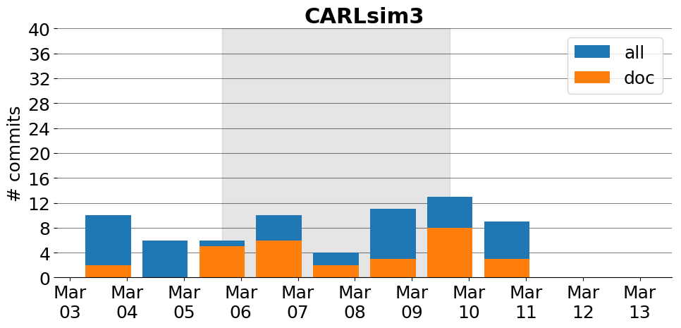

title: CARLsim3
date: 3/4/2017 20:33:19
modified: 2017-03-13
tags: projects, docathon
category: info
slug: projects/CARLsim3
authors: watchtower
summary: CARLsim3
status: hidden

# CARLsim3

## Information

* **Documentation**: [https://uci-carl.github.io/CARLsim3](https://uci-carl.github.io/CARLsim3)
* **Github organization**: [http://github.org/UCI-CARL/CARLsim3](http://github.org/UCI-CARL/CARLsim3)
* **Docathon project**: [https://github.com/UCI-CARL/CARLsim3/projects/1](https://github.com/UCI-CARL/CARLsim3/projects/1)

## Description
CARLsim is an efficient, easy-to-use, GPU-accelerated library for simulating large-scale spiking neural network (SNN) models with a high degree of biological detail. CARLsim allows execution of networks of Izhikevich spiking neurons with realistic synaptic dynamics on both generic x86 CPUs and standard off-the-shelf GPUs. The simulator provides a PyNN-like programming interface in C/C++, which allows for details and parameters to be specified at the synapse, neuron, and network level.

## Open Doc issues

* [User Guide: Better explain how to set up STDP](https://github.com/UCI-CARL/CARLsim3/issues/13)
* [Add a Tutorial that shows off multi-compartment models](https://github.com/UCI-CARL/CARLsim3/issues/11)
* [User Guide Chapter 5: Document DA-STDP](https://github.com/UCI-CARL/CARLsim3/issues/10)
* [Fix Doxygen issues on Windows](https://github.com/UCI-CARL/CARLsim3/issues/7)
* [Complete CARLsim API documentation](https://github.com/UCI-CARL/CARLsim3/issues/6)
* [Document PrePostGroupSpikeGen](https://github.com/UCI-CARL/CARLsim3/issues/5)
* [Document InteractiveSpikeGen](https://github.com/UCI-CARL/CARLsim3/issues/4)
* [User Guide, Chapter 10: ECJ installation info is out of date](https://github.com/UCI-CARL/CARLsim3/issues/1)

# Activity
---
