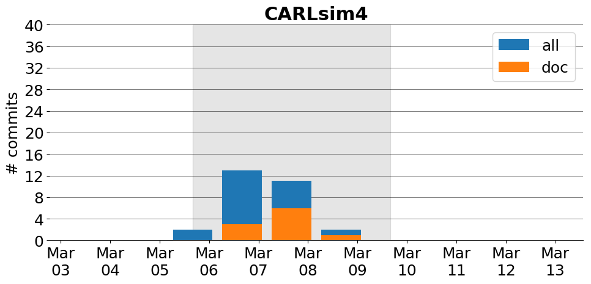

title: CARLsim4
date: 3/5/2017 16:38:05
modified: 2017-03-13
tags: projects, docathon
category: info
slug: projects/CARLsim4
authors: watchtower
summary: CARLsim4
status: hidden

# CARLsim4

## Information

* **Documentation**: [http://uci-carl.github.io/CARLsim4](http://uci-carl.github.io/CARLsim4)
* **Github organization**: [http://github.org/UCI-CARL/CARLsim4](http://github.org/UCI-CARL/CARLsim4)
* **Docathon project**: [https://github.com/UCI-CARL/CARLsim4/projects/1](https://github.com/UCI-CARL/CARLsim4/projects/1)

## Description
CARLsim is an efficient, easy-to-use, GPU-accelerated software framework for simulating large-scale spiking neural network (SNN) models with a high degree of biological detail. 

# Activity
---
