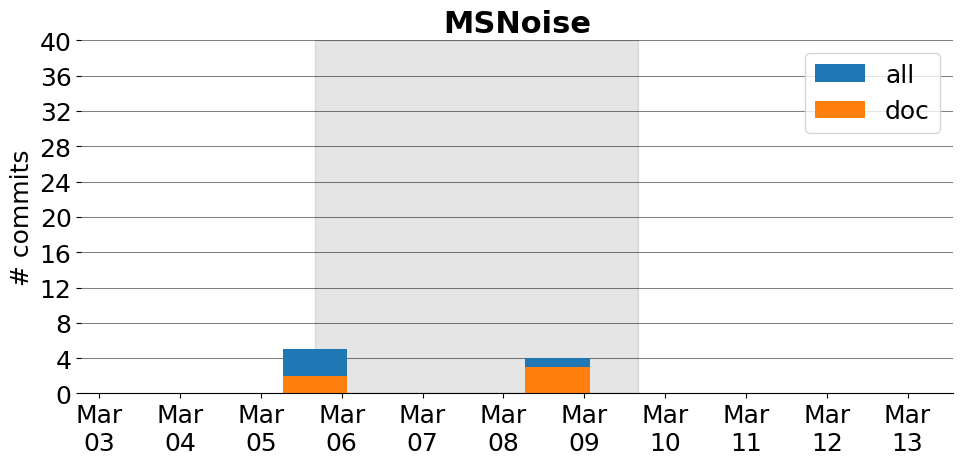

title: MSNoise
date: 2/28/2017 14:13:13
modified: 2017-03-13
tags: projects, docathon
category: info
slug: projects/MSNoise
authors: watchtower
summary: MSNoise
status: hidden

# MSNoise

## Information

* **Documentation**: [http://msnoise.org/doc/master](http://msnoise.org/doc/master)
* **Github organization**: [http://github.org/ROBelgium/MSNoise](http://github.org/ROBelgium/MSNoise)
## Description
A Python Package for Monitoring Seismic Velocity Changes using Ambient Seismic Noise

# Activity
---
