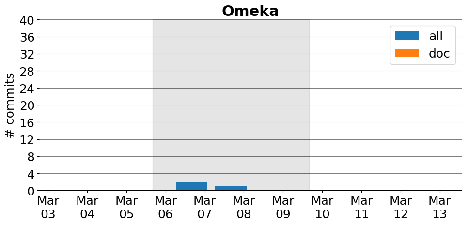

title: Omeka
date: 2/28/2017 7:19:49
modified: 2017-03-13
tags: projects, docathon
category: info
slug: projects/Omeka
authors: watchtower
summary: Omeka
status: hidden

# Omeka

## Information

* **Documentation**: [https://github.com/omeka/Documentation](https://github.com/omeka/Documentation)
* **Github organization**: [http://github.org/omeka/Omeka](http://github.org/omeka/Omeka)
## Description
 A flexible web publishing platform for the display of library, museum and scholarly collections, archives and exhibitions. 

# Activity
---
