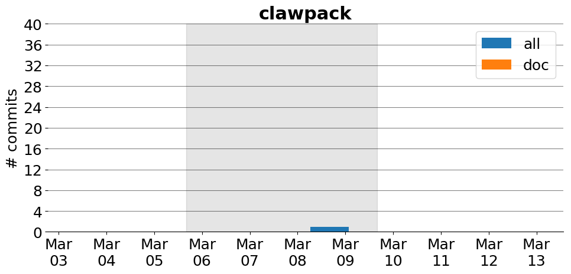

title: clawpack
date: 2/20/2017 10:33:03
modified: 2017-03-13
tags: projects, docathon
category: info
slug: projects/clawpack
authors: watchtower
summary: clawpack
status: hidden

# clawpack

## Information

* **Documentation**: [http://clawpack.org](http://clawpack.org)
* **Github organization**: [http://github.org/clawpack/clawpack](http://github.org/clawpack/clawpack)
* **Docathon project**: [https://github.com/clawpack/doc/issues?q=is%3Aissue+is%3Aopen+label%3Adocathon](https://github.com/clawpack/doc/issues?q=is%3Aissue+is%3Aopen+label%3Adocathon)

## Description
Clawpack (“Conservation Laws Package”) is a collection of finite volume methods for linear and nonlinear hyperbolic systems of conservation laws. Clawpack employs high-resolution Godunov-type methods with limiters in a general framework applicable to many kinds of waves.  It includes a number of subpackages including one for geophysical applications, adaptive mesh refinement, and high-order methods via WENO methods.

# Activity
---
