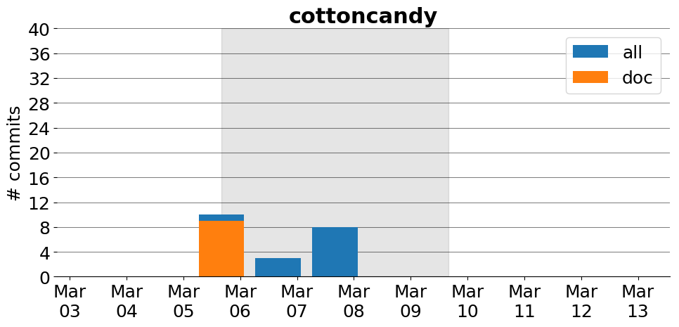

title: cottoncandy
date: 2/3/2017 13:35:02
modified: 2017-03-13
tags: projects, docathon
category: info
slug: projects/cottoncandy
authors: watchtower
summary: cottoncandy
status: hidden

# cottoncandy

## Information

* **Documentation**: [http://gallantlab.github.io/cottoncandy/](http://gallantlab.github.io/cottoncandy/)
* **Github organization**: [http://github.org/gallantlab/cottoncandy](http://github.org/gallantlab/cottoncandy)
## Description
cottoncandy is a python scientific library for storing and accessing numpy array data on S3. This is achieved by reading arrays from memory and downloading arrays directly into memory. This means that you don’t have to download your array to disk, and then load it from disk into your python session.

# Activity
---
