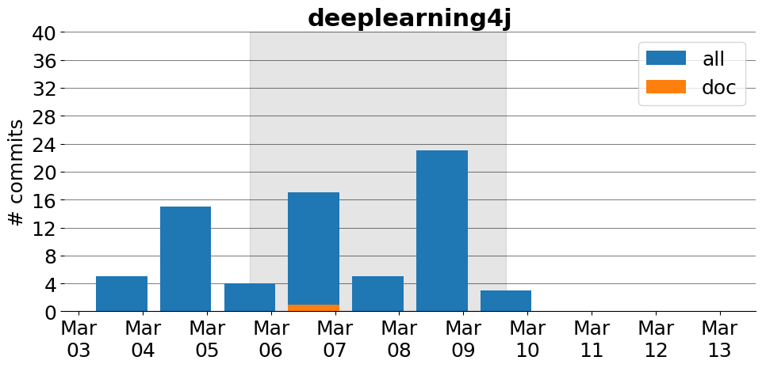

title: deeplearning4j
date: 3/2/2017 10:43:29
modified: 2017-03-13
tags: projects, docathon
category: info
slug: projects/deeplearning4j
authors: watchtower
summary: deeplearning4j
status: hidden

# deeplearning4j

## Information

* **Documentation**: [https://deeplearning4j.org/](https://deeplearning4j.org/)
* **Github organization**: [http://github.org/deeplearning4j/deeplearning4j](http://github.org/deeplearning4j/deeplearning4j)
* **Docathon project**: [https://github.com/deeplearning4j/deeplearning4j/projects/1](https://github.com/deeplearning4j/deeplearning4j/projects/1)

## Description
Deeplearning4j is the first commercial-grade, open-source, distributed deep-learning library written for Java and Scala. Integrated with Hadoop and Spark, DL4J is designed to be used in business environments on distributed GPUs and CPUs.

## Open Doc issues

* [Comparing frameworks documentation issue for TensorFlow](https://github.com/deeplearning4j/deeplearning4j/issues/2914)
* [Docs: add basic docs on DL4J + cloud computing](https://github.com/deeplearning4j/deeplearning4j/issues/3006)
* [Create a normalization page](https://github.com/deeplearning4j/deeplearning4j/issues/2858)
* [Build WebApp for VGG model inference](https://github.com/deeplearning4j/deeplearning4j/issues/2734)
* [JavaDocs missing for Clustering classes](https://github.com/deeplearning4j/deeplearning4j/issues/2994)
* [Output page contains obsolete code](https://github.com/deeplearning4j/deeplearning4j/issues/2991)
* [Update on-site documentation](https://github.com/deeplearning4j/deeplearning4j/issues/2945)
* [Dev guide: document intellij quirks](https://github.com/deeplearning4j/deeplearning4j/issues/2941)
* [Build Lucene index over javadoc, examples, and other resources](https://github.com/deeplearning4j/deeplearning4j/issues/2934)

# Activity
---
