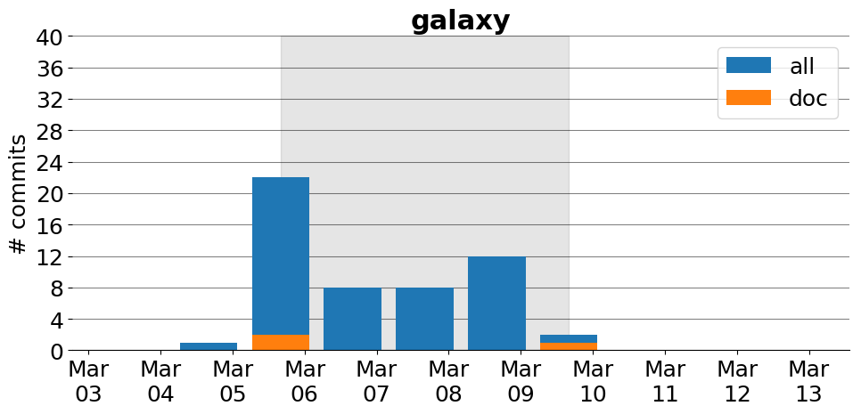

title: galaxy
date: 3/3/2017 10:44:57
modified: 2017-03-13
tags: projects, docathon
category: info
slug: projects/galaxy
authors: watchtower
summary: galaxy
status: hidden

# galaxy

## Information

* **Documentation**: [http://docs.galaxyproject.org, new.galaxyproject.org](http://docs.galaxyproject.org, new.galaxyproject.org)
* **Github organization**: [http://github.org/galaxyproject/galaxy](http://github.org/galaxyproject/galaxy)
* **Docathon project**: [(not currently, but I can work on a list this weekend)]((not currently, but I can work on a list this weekend))

## Description
Galaxy is an open, web-based platform for data intensive biomedical research.

## Open Doc issues

* [Boring documentation and unconstructive rant](https://github.com/galaxyproject/galaxy/issues/3735)
* [typo in tool syntax doc](https://github.com/galaxyproject/galaxy/issues/3667)

# Activity
---
