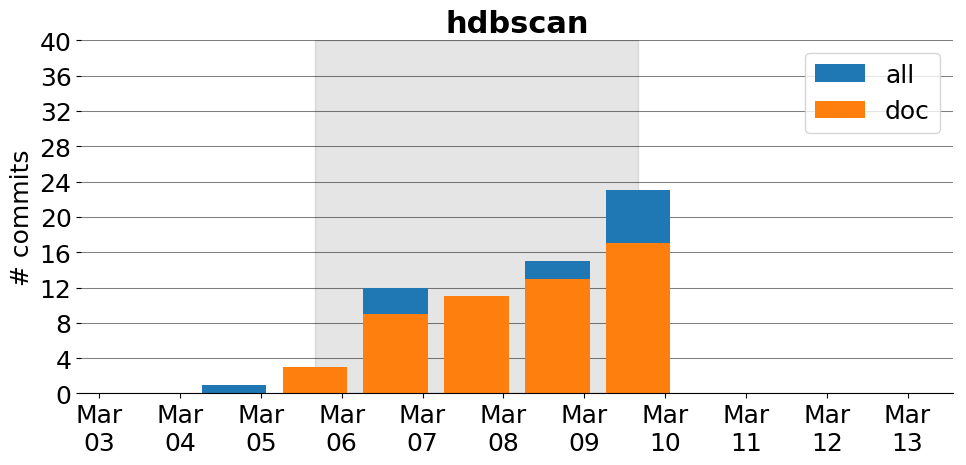

title: hdbscan
date: 2/21/2017 11:30:35
modified: 2017-03-13
tags: projects, docathon
category: info
slug: projects/hdbscan
authors: watchtower
summary: hdbscan
status: hidden

# hdbscan

## Information

* **Documentation**: [http://hdbscan.readthedocs.io](http://hdbscan.readthedocs.io)
* **Github organization**: [http://github.org/scikit-learn-contrib/hdbscan](http://github.org/scikit-learn-contrib/hdbscan)
* **Docathon project**: [https://github.com/scikit-learn-contrib/hdbscan/projects/3](https://github.com/scikit-learn-contrib/hdbscan/projects/3)

## Description
Hdbscan is a Python clustering library for hierarchical density based clustering. It provides high performance implementations of two clustering algorithms: HDBSCAN* and Robust Single Linkage, as well as a suite of tools for further analysis, including plotting tools, cluster validations measures, prediction, and soft clustering. The hdbscan library conforms to Scikit-learn, and seeks to provide an easy to use interface for fast and easy clustering, particularly for exploratory data analysis.

# Activity
---
