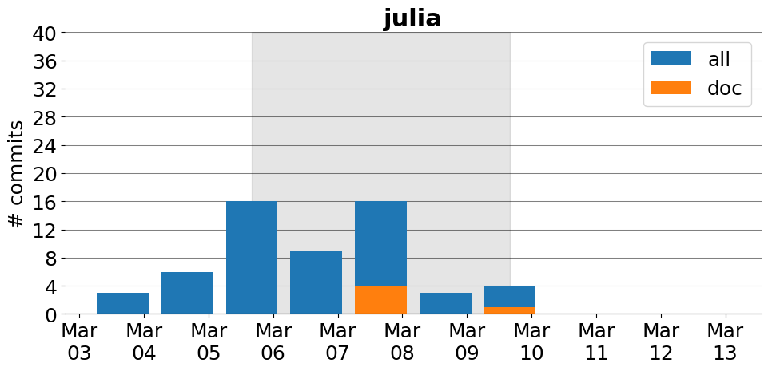

title: julia
date: 3/3/2017 17:10:13
modified: 2017-03-13
tags: projects, docathon
category: info
slug: projects/julia
authors: watchtower
summary: julia
status: hidden

# julia

## Information

* **Documentation**: [http://docs.julialang.org](http://docs.julialang.org)
* **Github organization**: [http://github.org/JuliaLang/julia](http://github.org/JuliaLang/julia)
## Description
Julia is a high-level, high-performance, dynamic programming language for technical computing. It provides a sophisticated compiler, distributed parallel execution, numerical accuracy, and an extensive mathematical function library. Julia’s Base library, largely written in Julia itself, also integrates mature, best-of-breed open source C and Fortran libraries for linear algebra, random number generation, signal processing, and string processing. In addition, the Julia developer community is contributing a number of external packages through Julia’s built-in package manager at a rapid pace. IJulia, a collaboration between the Jupyter and Julia communities, provides a powerful browser-based graphical notebook interface to Julia.

## Open Doc issues

* [Manual describes deprecated inner constructor syntax](https://github.com/JuliaLang/julia/issues/20877)
* [Edit link in HTML docs](https://github.com/JuliaLang/julia/issues/20870)
* [Still unable to search for macros in the doc](https://github.com/JuliaLang/julia/issues/20828)
* [DOC: Memory layout - list of dead terms/links @ Manual](https://github.com/JuliaLang/julia/issues/20813)
* [Clarify "Working with Files" regarding encoding in the docs](https://github.com/JuliaLang/julia/issues/20973)
* [document that shift operators on BitVectors accept negative shifts](https://github.com/JuliaLang/julia/issues/20788)
* [Wishlist: documentation for extending broadcast](https://github.com/JuliaLang/julia/issues/20740)
* [Add warning note to do-block doc](https://github.com/JuliaLang/julia/issues/20964)
* [document `rem(x,T)` / `x % T` for `T` a type](https://github.com/JuliaLang/julia/issues/20707)
* [conv corner case](https://github.com/JuliaLang/julia/issues/20539)
* [svds documentation doesn't explain how to extract factors](https://github.com/JuliaLang/julia/issues/19857)
* [DOC: Rewrite manual for parallel ](https://github.com/JuliaLang/julia/issues/19579)
* ["invalid subtyping" breaking change in 0.6](https://github.com/JuliaLang/julia/issues/20949)
* [Manual: "Running External Programs" does not explain how to change working directory](https://github.com/JuliaLang/julia/issues/19286)
* [Documentation: "Noteworthy Differences from other Languages" -- outdated information + minor mistakes](https://github.com/JuliaLang/julia/issues/18656)
* [Filter is not documented](https://github.com/JuliaLang/julia/issues/16742)
* [document io and trailing args for print/ln](https://github.com/JuliaLang/julia/issues/15693)
* [REPL integrated readline](https://github.com/JuliaLang/julia/issues/10667)
* [Use of ÷ in the manual](https://github.com/JuliaLang/julia/issues/20915)
* [Function help within REPL hangs, then produces 6357 lines of output.](https://github.com/JuliaLang/julia/issues/20904)

# Activity
---
