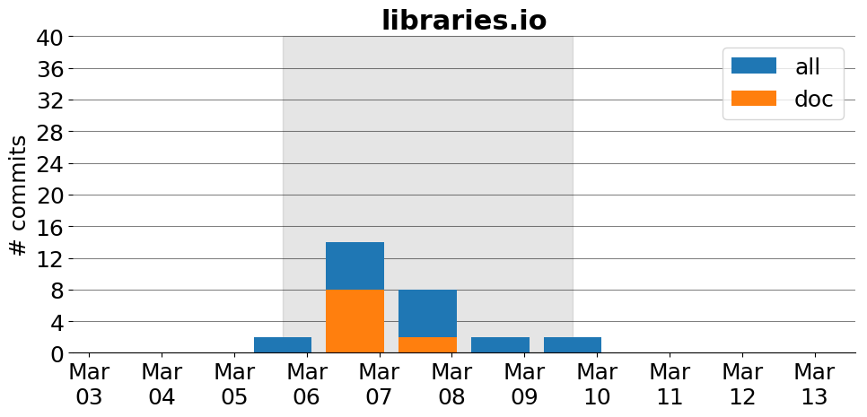

title: libraries.io
date: 3/3/2017 1:44:03
modified: 2017-03-13
tags: projects, docathon
category: info
slug: projects/libraries.io
authors: watchtower
summary: libraries.io
status: hidden

# libraries.io

## Information

* **Documentation**: [http://docs.libraries.io](http://docs.libraries.io)
* **Github organization**: [http://github.org/librariesio/libraries.io](http://github.org/librariesio/libraries.io)
* **Docathon project**: [https://github.com/librariesio/documentation/projects/1](https://github.com/librariesio/documentation/projects/1)

## Description
Libraries.io indexes over 2 million unique, open source projects from 33 package mangers (and growing) to help you make more informed decisions about the software you use. 

## Open Doc issues

* [Add Crystal docs links](https://github.com/librariesio/libraries.io/issues/1034)
* [Document the dependency tree API endpoint](https://github.com/librariesio/libraries.io/issues/983)
* [Add a Glossary of Terms to the documentation](https://github.com/librariesio/libraries.io/issues/1256)
* [API Documentation ](https://github.com/librariesio/libraries.io/issues/198)
* [Add 'roadmap' to documentation](https://github.com/librariesio/libraries.io/issues/1250)
* [Pull in/generate documentation for projects](https://github.com/librariesio/libraries.io/issues/31)
* [Add infrastrucutre to documentation](https://github.com/librariesio/libraries.io/issues/1249)
* [API docs: http status codes ](https://github.com/librariesio/libraries.io/issues/1245)
* [Add EULA to API ](https://github.com/librariesio/libraries.io/issues/1269)
* [Add feature to request for more than one package from the api](https://github.com/librariesio/libraries.io/issues/1214)

# Activity
---
