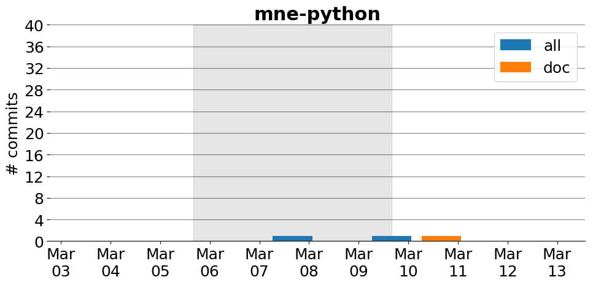

title: mne-python
date: 2/21/2017 9:56:38
modified: 2017-03-13
tags: projects, docathon
category: info
slug: projects/mne-python
authors: watchtower
summary: mne-python
status: hidden

# mne-python

## Information

* **Documentation**: [https://mne-tools.github.io/stable/index.html](https://mne-tools.github.io/stable/index.html)
* **Github organization**: [http://github.org/mne-tools/mne-python](http://github.org/mne-tools/mne-python)
* **Docathon project**: [https://github.com/mne-tools/mne-python/issues/3985](https://github.com/mne-tools/mne-python/issues/3985)

## Description
MNE is designed for sensor- and source-space analysis of [M/E]EG data and ECoG data, including frequency-domain and time-frequency analyses, MVPA/decoding and non-parametric statistics. This package generally evolves quickly and user contributions can easily be incorporated thanks to the open development environment .

# Activity
---
