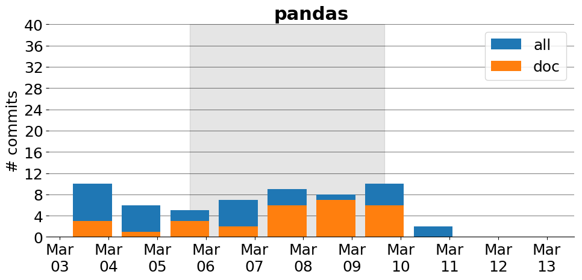

title: pandas
date: 2/17/2017 1:09:00
modified: 2017-03-13
tags: projects, docathon
category: info
slug: projects/pandas
authors: watchtower
summary: pandas
status: hidden

# pandas

## Information

* **Documentation**: [http://pandas.pydata.org/pandas-docs/stable/](http://pandas.pydata.org/pandas-docs/stable/)
* **Github organization**: [http://github.org/pandas-dev/pandas](http://github.org/pandas-dev/pandas)
* **Docathon project**: [https://github.com/pandas-dev/pandas/projects/1](https://github.com/pandas-dev/pandas/projects/1)

## Description
pandas is an open source library for data analysis in Python. It is a powerful toolkit for manipulating and analysing structured data, providing high-performance, easy-to-use data structures and data analysis tools for the Python programming language.

## Open Doc issues

* [DOC: DataFrame.plot options are not documented in docstring form](https://github.com/pandas-dev/pandas/issues/15458)
* [Docathon - documentation hackaton - week of March 6th](https://github.com/pandas-dev/pandas/issues/15405)
* [DOC: reorganisation of the documentation?](https://github.com/pandas-dev/pandas/issues/6000)
* [pd.set_eng_float_format() function not documented in the API reference](https://github.com/pandas-dev/pandas/issues/15610)
* [DOC: inconsistent docs-string signatures for shared functions](https://github.com/pandas-dev/pandas/issues/15609)
* [DOC: enable parallel building of the docs](https://github.com/pandas-dev/pandas/issues/15591)
* [DOC: overall improvement of docstrings](https://github.com/pandas-dev/pandas/issues/15580)
* [DOC: doc build on travis timing out](https://github.com/pandas-dev/pandas/issues/15559)

# Activity
---
