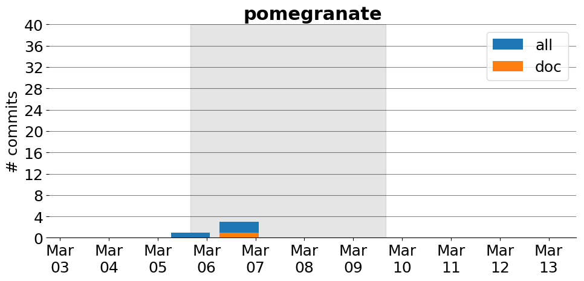

title: pomegranate
date: 2/16/2017 15:52:52
modified: 2017-03-13
tags: projects, docathon
category: info
slug: projects/pomegranate
authors: watchtower
summary: pomegranate
status: hidden

# pomegranate

## Information

* **Documentation**: [http://pomegranate.readthedocs.io/en/latest/](http://pomegranate.readthedocs.io/en/latest/)
* **Github organization**: [http://github.org/jmschrei/pomegranate](http://github.org/jmschrei/pomegranate)
## Description
pomegranate is a probabilistic modeling library for Python which seeks to compliment scikit-learn by providing structured models which follow the same API, such as hidden Markov models and Bayesian networks. It is implemented in cython for both speedy computation and native parallelization of all methods. Lastly, it has out-of-core training for fitting models to massive amounts of memory. What it doesn't have is an excess of documentation guiding people through its use. 

# Activity
---
