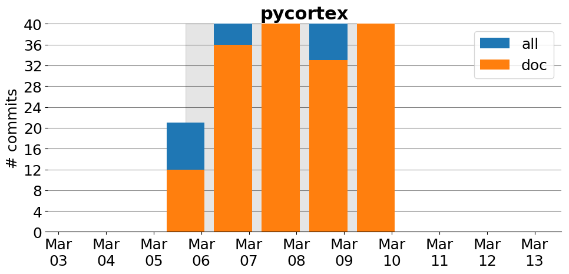
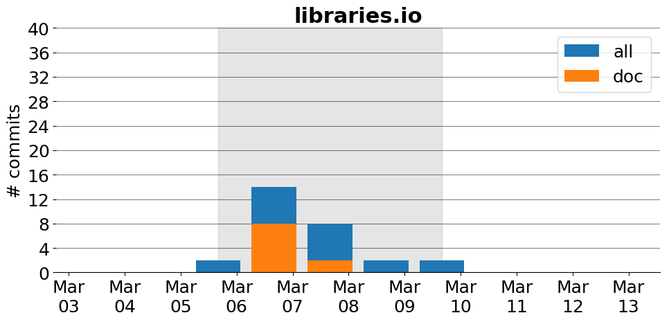
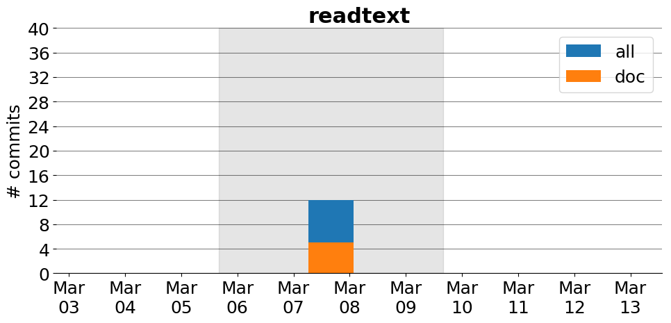
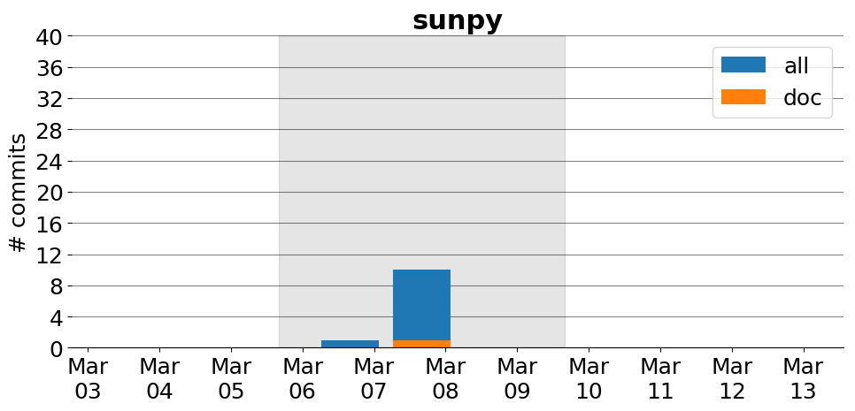

Title: Projects
Date: 2017-02-18
Modified: 2017-03-13
Tags: projects, docathon
Category: info
Slug: projects/projects
Authors: watchtower
Summary: List of projects

# Projects

 Here is a list of projects involved in the Docathon along with information about contributions to their documentation. If you'd like to help out with a project, click an image below to see more information about it. If you'd like to see your project here, please fill in [this registration form](https://goo.gl/forms/0cPpw01zehrEyDDE3) 

Docathon projects
---
[academicpages](academicpages.github.io.html)&nbsp;&nbsp;-&nbsp;&nbsp;[bokeh](bokeh.html)&nbsp;&nbsp;-&nbsp;&nbsp;[carlsim3](CARLsim3.html)&nbsp;&nbsp;-&nbsp;&nbsp;[carlsim4](CARLsim4.html)&nbsp;&nbsp;-&nbsp;&nbsp;[clawpack](clawpack.html) [cottoncandy](cottoncandy.html)&nbsp;&nbsp;-&nbsp;&nbsp;[data science education infrastructure](connector-instructors.html)&nbsp;&nbsp;-&nbsp;&nbsp;[deeplearning4j](deeplearning4j.html)&nbsp;&nbsp;-&nbsp;&nbsp;[diy](diy.html)&nbsp;&nbsp;-&nbsp;&nbsp;[galaxy](galaxy.html) [galaxy hub](galaxy-hub.html)&nbsp;&nbsp;-&nbsp;&nbsp;[getorg](getorg.html)&nbsp;&nbsp;-&nbsp;&nbsp;[hdbscan](hdbscan.html)&nbsp;&nbsp;-&nbsp;&nbsp;[henson](henson.html)&nbsp;&nbsp;-&nbsp;&nbsp;[ipython](ipython.html) [julia](julia.html)&nbsp;&nbsp;-&nbsp;&nbsp;[jupyter](notebook.html)&nbsp;&nbsp;-&nbsp;&nbsp;[libraries.io](libraries.io.html)&nbsp;&nbsp;-&nbsp;&nbsp;[matplotlib](matplotlib.html)&nbsp;&nbsp;-&nbsp;&nbsp;[mne-python](mne-python.html) [msnoise](MSNoise.html)&nbsp;&nbsp;-&nbsp;&nbsp;[omeka](Omeka.html)&nbsp;&nbsp;-&nbsp;&nbsp;[pandas](pandas.html)&nbsp;&nbsp;-&nbsp;&nbsp;[pmagpy](pmagpy.html)&nbsp;&nbsp;-&nbsp;&nbsp;[pomegranate](pomegranate.html) [pulse2percept](pulse2percept.html)&nbsp;&nbsp;-&nbsp;&nbsp;[pycortex](pycortex.html)&nbsp;&nbsp;-&nbsp;&nbsp;[quanteda](quanteda.html)&nbsp;&nbsp;-&nbsp;&nbsp;[quanteda_readtext](readtext.html)&nbsp;&nbsp;-&nbsp;&nbsp;[scikit-image](scikit-image.html) [scikit-learn](scikit-learn.html)&nbsp;&nbsp;-&nbsp;&nbsp;[scipy](scipy.html)&nbsp;&nbsp;-&nbsp;&nbsp;[sncosmo](sncosmo.html)&nbsp;&nbsp;-&nbsp;&nbsp;[sunpy](sunpy.html)&nbsp;&nbsp;-&nbsp;&nbsp;[sylius](Sylius.html)&nbsp;&nbsp;-&nbsp;&nbsp;[watchtower](watchtower.html)&nbsp;&nbsp;-&nbsp;&nbsp;[yt](yt.html) 
# Project leaders

# Project contributions
