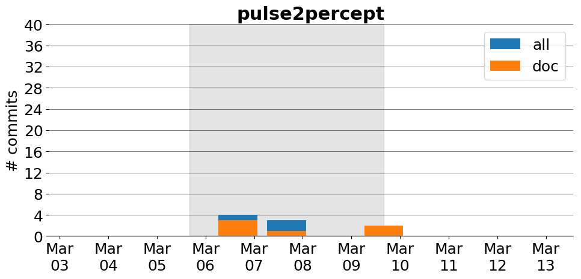

title: pulse2percept
date: 3/3/2017 18:36:25
modified: 2017-03-13
tags: projects, docathon
category: info
slug: projects/pulse2percept
authors: watchtower
summary: pulse2percept
status: hidden

# pulse2percept

## Information

* **Documentation**: [https://uwescience.github.io/pulse2percept/](https://uwescience.github.io/pulse2percept/)
* **Github organization**: [http://github.org/uwescience/pulse2percept](http://github.org/uwescience/pulse2percept)
## Description
Pulse2percept is a Python library for bionic vision. It features a computational model that has the goal of predicting the perceptual experience of retinal prosthesis patients. The model takes as input a series of (simulated) electrical pulse trains---one pulse train per electrode in the array---and converts them into an image sequence that corresponds to the predicted perceptual experience of a patient.

## Open Doc issues

* [Add "Edit on GitHub" button to docs](https://github.com/uwescience/pulse2percept/issues/70)

# Activity
---
