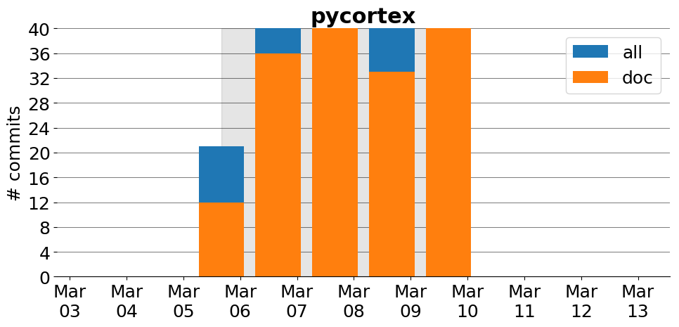

title: pycortex
date: 2/2/2017 10:36:23
modified: 2017-03-13
tags: projects, docathon
category: info
slug: projects/pycortex
authors: watchtower
summary: pycortex
status: hidden

# pycortex

## Information

* **Documentation**: [http://gallantlab.org/pycortex/docs/](http://gallantlab.org/pycortex/docs/)
* **Github organization**: [http://github.org/gallantlab/pycortex](http://github.org/gallantlab/pycortex)
* **Docathon project**: [Not yet, but we will do.](Not yet, but we will do.)

## Description
Pycortex is a python-based toolkit for surface visualization in functional magnetic resonance imaging (fMRI) data. 

## Open Doc issues

* [doc (setup): Travis doc generation working ](https://github.com/gallantlab/pycortex/issues/198)
* [doc (general): Pycortex store directory structure & database ](https://github.com/gallantlab/pycortex/issues/196)
* [doc (general): Creating and managing ROIs with the SVG file ](https://github.com/gallantlab/pycortex/issues/195)
* [doc: quickflat docstring mismatches](https://github.com/gallantlab/pycortex/issues/188)
* [doc (general): segmentation](https://github.com/gallantlab/pycortex/issues/186)
* [doc (gallery): meg ](https://github.com/gallantlab/pycortex/issues/185)
* [doc (gallery): utils](https://github.com/gallantlab/pycortex/issues/183)
* [doc (gallery): webgl](https://github.com/gallantlab/pycortex/issues/182)
* [doc (gallery): quickflat](https://github.com/gallantlab/pycortex/issues/181)
* [doc (gallery): datasets](https://github.com/gallantlab/pycortex/issues/180)
* [doc (gallery): import_surface](https://github.com/gallantlab/pycortex/issues/179)
* [doc (gallery): quickstart](https://github.com/gallantlab/pycortex/issues/178)

# Activity
---
