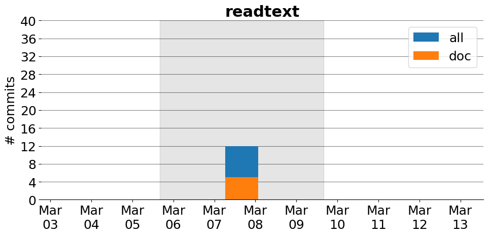

title: readtext
date: 3/1/2017 10:27:55
modified: 2017-03-13
tags: projects, docathon
category: info
slug: projects/readtext
authors: watchtower
summary: readtext
status: hidden

# readtext

## Information

* **Documentation**: [https://kbenoit.github.io/quanteda/](https://kbenoit.github.io/quanteda/)
* **Github organization**: [http://github.org/kbenoit/readtext](http://github.org/kbenoit/readtext)
* **Docathon project**: [https://github.com/kbenoit/readtext/projects/1](https://github.com/kbenoit/readtext/projects/1)

## Description
readtext is a one-function companion package for quanteda, but also one that works completely generally, to do exactly what it says on the tin: It reads files containing text, along with any associated document-level metadata, which we call "docvars", for document variables. Plain text files do not have docvars, but other forms such as .csv, .tab, .xml, and .json files usually do. It can also accept wildcard characters.

# Activity
---
