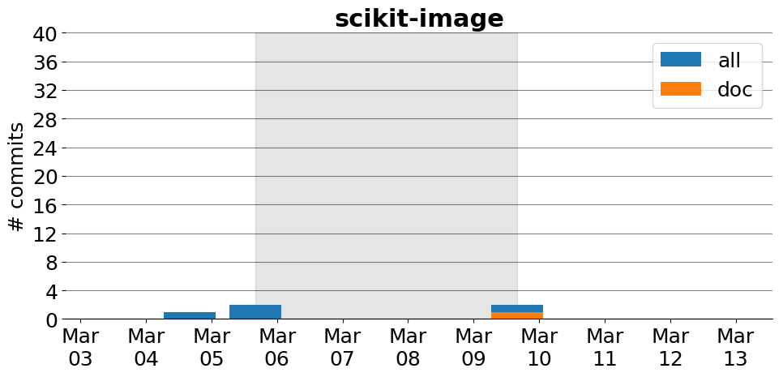

title: scikit-image
date: 2/19/2017 17:16:17
modified: 2017-03-13
tags: projects, docathon
category: info
slug: projects/scikit-image
authors: watchtower
summary: scikit-image
status: hidden

# scikit-image

## Information

* **Documentation**: [http://scikit-image.org](http://scikit-image.org)
* **Github organization**: [http://github.org/scikit-image/scikit-image](http://github.org/scikit-image/scikit-image)
## Description
scikit-image is a collection of algorithms for image processing. It is available free of charge and free of restriction. We pride ourselves on high-quality, peer-reviewed code, written by an active community of volunteers.

Our documentation can do with some love :)

## Open Doc issues

* [Add example in gallery about downscaling/upscaling/resizing images](https://github.com/scikit-image/scikit-image/issues/2559)
* [Add a section to the user guide, showing how to interact between skimage and opencv](https://github.com/scikit-image/scikit-image/issues/2500)
* [Add `np.lookfor` as a discoverability tip to the User Guide](https://github.com/scikit-image/scikit-image/issues/2426)
* [Use `plane, row, col` dimensions ordering as specified in the `skimage` conventions page](https://github.com/scikit-image/scikit-image/issues/2276)

# Activity
---
