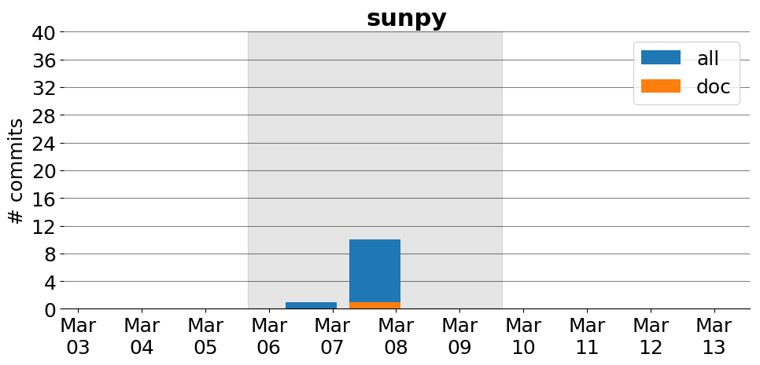

title: sunpy
date: 3/6/2017 1:27:06
modified: 2017-03-13
tags: projects, docathon
category: info
slug: projects/sunpy
authors: watchtower
summary: sunpy
status: hidden

# sunpy

## Information

* **Documentation**: [http://docs.sunpy.org/](http://docs.sunpy.org/)
* **Github organization**: [http://github.org/sunpy/sunpy](http://github.org/sunpy/sunpy)
* **Docathon project**: [https://github.com/sunpy/sunpy/projects/4](https://github.com/sunpy/sunpy/projects/4)

## Description
SunPy is a community-developed free and open-source software package for solar physics. SunPy is meant to be a free alternative to the SolarSoft data analysis environment which is based on the IDL scientific programming language sold by Exelis. Though SolarSoft is open-source IDL is not and can be prohibitively expensive. The aim of the SunPy project is to provide the software tools necessary so that anyone can analyze solar data. SunPy is written using the Python programming language and is build upon the scientific Python environment which includes the core packages NumPy, SciPy. The development of SunPy is associated with that of Astropy. SunPy was founded on March 28, 2011 by a small group of scientists and developers at the NASA Goddard Space Flight Center. Thanks to the generous support of the ESA Summer of Code and the Google Summer of Code as well as contributors from around the world, SunPy is now a global project and is not associated with any individual institution. 

## Open Doc issues

* [Install documentation should suggest a Python version](https://github.com/sunpy/sunpy/issues/1704)
* [Fix doctests and enable them on Travis](https://github.com/sunpy/sunpy/issues/1177)

# Activity
---
